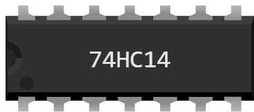

# 74xx14 — 六路施密特触发反相器

用于面包板的 DIL-14 封装：**六个独立的反相器**。反相器输出与输入 **相反** 的电平 — 1 变 0，0 变 1。

74 系列：型号中的 “xx” 代表 **系列**（HC、LS、HCT…）。它不改变功能和引脚排列，但决定 **供电范围** — 也就决定了芯片能在哪块开发板上工作。

| 系列 | 电源 |
|---|---|
| HC, AC, ACT | 2 到 6 V |
| C | 3 到 15 V |
| HCT, ALS, F | 4.5 到 5 V |
| S, LS | 4.75 到 5.25 V |

Uno 输出 5 V：所有系列都能用。**Pico 只输出 3.3 V**：只有 HC、AC、ACT 和 C 能用 — 74LS 型号（如 74LS14）接在 Pico 上不工作。

这些是 **施密特触发** 反相器：在真实硬件上，它们的翻转阈值在上升时升高、下降时降低，可以整形缓慢或有噪声的信号。仿真中电平都很干净，因此看不到迟滞。它是 [CD40106](cd40106.md) 在 74 系列中的对应型号。

## 引脚

| 引脚 | 名称 | 作用 |
|---|---|---|
| 1 | **a** | 反相器 A 的输入 |
| 2 | **a̅** | 反相器 A 的输出（上划线 = 反相） |
| 3 | **b** | 反相器 B 的输入 |
| 4 | **b̅** | 反相器 B 的输出（上划线 = 反相） |
| 5 | **c** | 反相器 C 的输入 |
| 6 | **c̅** | 反相器 C 的输出（上划线 = 反相） |
| 7 | **GND** | 地 — **黑线** |
| 8 | **d̅** | 反相器 D 的输出（上划线 = 反相） |
| 9 | **d** | 反相器 D 的输入 |
| 10 | **e̅** | 反相器 E 的输出（上划线 = 反相） |
| 11 | **e** | 反相器 E 的输入 |
| 12 | **f̅** | 反相器 F 的输出（上划线 = 反相） |
| 13 | **f** | 反相器 F 的输入 |
| 14 | **VCC** | 电源 — **红线** |

## 真值表

一个反相器；其余五个完全相同。

| a | a̅ |
|---|---|
| 0 | 1 |
| 1 | 0 |

## 属性

| 属性 | 作用 | 默认值 |
|---|---|---|
| `ref` | 型号 — 修改它会改变引脚排列，但不改变图形 | 74xx14 |
| `family` | 74 系列的子系列：决定供电范围 | HC |

## 仿真

- **必须供电**：VCC（引脚 14）没接红线、GND（引脚 7）没接黑线时，芯片没有任何输出。
- 超出 **所选系列的范围（HC 为 2 到 6 V）** 时，Kablix 会提示 “电源电压不兼容”。**低于** 该范围芯片不工作；**高于** 该范围芯片会被 损坏 — 显示红叉，直到下一次运行都保持这样。
- **悬空的输入不等于 0**：只要这个输入起作用，输出就不确定 — 而对这个功能来说它总是起作用。
- 输出能像开发板引脚一样驱动电路：**带限流电阻的** LED、三极管基极，或另一个芯片的输入。

## 用法

- 反相器把逻辑电平变成相反的电平；两个串联时电平不变，但能 **整形信号**。
- 封装中的 6 个反相器相互独立：一个芯片可以同时用于 6 个互不相关的用途。
- 把输入接到开发板的输出，把输出接到开发板的输入：程序读到的就是芯片计算出的结果，而不是微控制器算出的。
- 现成的测试：`testkablix/` 中的 `CI-uno` 和 `CI-pico` — 十二个芯片接在一起，每个门都经过检查。

---

*Kablix 自有元件 — 图形由 Frank Sauret 绘制。*
