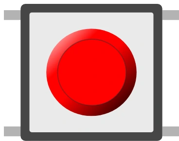

# 轻触按钮 (6 mm)

6 mm 小型轻触按钮，行为与 12 mm 按钮相同。

## 引脚

| 引脚 | 作用 |
|--------|------|
| **1.l / 1.r** | 第一个触点 |
| **2.l / 2.r** | 第二个触点 |

## 属性

| 属性 | 作用 | 默认值 |
|-----------|------|--------|
| `color` | 颜色 | 红 |
| `key` | 键盘快捷键 | — |

## 用法

- 与 12 mm 按钮相同：`INPUT_PULLUP` + 接地（按下 = `LOW`），或者反过来接 **+5 V**，并用 **10 kΩ** 下拉电阻接地（按下 = `HIGH`）。
- 建议做消抖处理。

---

*本页根据 [Wokwi 文档](https://docs.wokwi.com/parts/wokwi-pushbutton-6mm) 改编并翻译 — © Wokwi。`@wokwi/elements` 元件（MIT 许可证）。*
