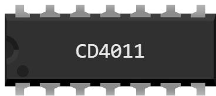

# CD4011 — 四路 2 输入与非门

用于面包板的 DIL-14 封装：**四个独立的与非门**，每个门有两个输入和一个输出。**只有两个输入都为 1 时** 与非门才输出 0：相当于与门后接一个反相器。

CMOS 4000 系列：工作电压 **3 到 18 V**，是这一组中范围最宽的 — 无论是 Uno 的 5 V 还是 Pico 的 3.3 V 都能用。

## 引脚

| 引脚 | 名称 | 作用 |
|---|---|---|
| 1 | **A1** | 门 1 的输入 A |
| 2 | **B1** | 门 1 的输入 B |
| 3 | **Q1** | 门 1 的输出 |
| 4 | **Q2** | 门 2 的输出 |
| 5 | **A2** | 门 2 的输入 A |
| 6 | **B2** | 门 2 的输入 B |
| 7 | **GND** | 地 — **黑线** |
| 8 | **A3** | 门 3 的输入 A |
| 9 | **B3** | 门 3 的输入 B |
| 10 | **Q3** | 门 3 的输出 |
| 11 | **Q4** | 门 4 的输出 |
| 12 | **A4** | 门 4 的输入 A |
| 13 | **B4** | 门 4 的输入 B |
| 14 | **VDD** | 电源 — **红线** |

## 真值表

一个门；其他门完全相同。

| A | B | Q |
|---|---|---|
| 0 | 0 | 1 |
| 0 | 1 | 1 |
| 1 | 0 | 1 |
| 1 | 1 | 0 |

## 属性

| 属性 | 作用 | 默认值 |
|---|---|---|
| `ref` | 型号 — 修改它会改变引脚排列，但不改变图形 | CD4011 |

## 仿真

- **必须供电**：VDD（引脚 14）没接红线、GND（引脚 7）没接黑线时，芯片没有任何输出。
- 超出 **3 到 18 V** 的范围时，Kablix 会提示 “电源电压不兼容”。**低于** 该范围芯片不工作；**高于** 该范围芯片会被 损坏 — 显示红叉，直到下一次运行都保持这样。
- **悬空的输入不等于 0**：只要这个输入起作用，输出就不确定（这里只要一个输入为 0 就能决定结果）。
- 输出能像开发板引脚一样驱动电路：**带限流电阻的** LED、三极管基极，或另一个芯片的输入。

## 用法

- 与非门是 **通用** 门：用它可以搭出所有其他逻辑功能。把它的两个输入连在一起，它就变成反相器。
- 封装中的 4 个门相互独立：一个芯片可以同时用于 4 个互不相关的用途。
- 把输入接到开发板的输出，把输出接到开发板的输入：程序读到的就是芯片计算出的结果，而不是微控制器算出的。
- 现成的测试：`testkablix/` 中的 `CI-uno` 和 `CI-pico` — 十二个芯片接在一起，每个门都经过检查。

---

*Kablix 自有元件 — 图形由 Frank Sauret 绘制。*
