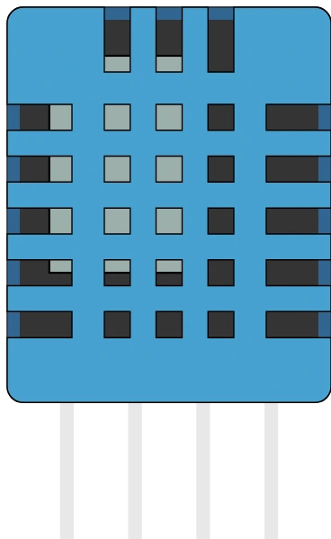

# DHT11 温湿度传感器

单总线数字温湿度传感器，DHT22 的蓝色小兄弟：精度较低、量程较窄，但协议和接线相同。

## 引脚

| 引脚 | 作用 |
|--------|------|
| **VCC** | 电源 (+) |
| **DATA** | 数据（单总线） |
| **NC** | 不连接 |
| **GND** | 地 |

## 属性

| 属性 | 作用 | 默认值 |
|-----------|------|--------|
| `temperature` | 温度 (°C) | 22 |
| `humidity` | 湿度 (%) | 50 |
| `angle` | 方向 (0/90/180/270°) | 0 |

## 用法

- DATA 接数字引脚（10 kΩ 上拉）。
- DHT 库：约每 2 秒读取一次。读得太快时，它会返回 **缓存的值**，与真实传感器完全一样。
- 仿真时，两个滑块可在程序运行 **期间** 设置温度和湿度：下一次读取即返回新值。
- DHT11 的限制，仿真中同样遵守：温度 0 到 +50 ℃，湿度 20 到 90 %RH，均为 **整数**（DHT11 既不编码小数，也不编码负数）。超出范围的设置会被限制到传感器的极限值。在真实硬件上，还要考虑 ±2.0 ℃ 和 ±5.0 %RH 的误差。
- 需要更高精度、负温度或极端湿度？请使用 [DHT22](dht22.md)。

---

*本页根据 [Wokwi 文档](https://docs.wokwi.com/parts/wokwi-dht22) 改编并翻译 — © Wokwi。`@wokwi/elements` 元件（MIT 许可证）。外壳图形：Frank Sauret。*
