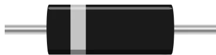

# 二极管

整流二极管。电流只能从阳极 **A** 流向阴极 **K**，途中损失一个阈值电压。

## 引脚

| 引脚 | 作用 |
|--------|------|
| **A** | 阳极 (+) — 图形上与色环相对的一端 |
| **K** | 阴极 (−) — 有色环标记的一端 |

## 属性

| 属性 | 作用 | 默认值 |
|-----------|------|--------|
| `vf` | 阈值电压 (V) | 0.6 |
| `angle` | 方向 (0/90/180/270°) | 0 |

## 用法

- 有极性：K → A 方向截止。接在反向二极管后面的 LED 永远不会亮 — 这是最简单的测试。
- 正向导通时，下游电压降低 `vf`（硅二极管 0.6 V，肖特基二极管 0.3 V）。
- 可用于防止输入端接反电源，或作为续流二极管并联在线圈（继电器、电机）两端，抑制其电压尖峰。

---

*Kablix 自有元件 — 图形由 Frank Sauret 绘制。*
