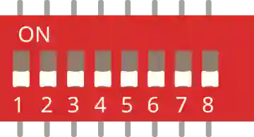

# 8 位拨码开关

由 8 个独立微型开关组成的模块（用于配置 / 地址设置）。

## 引脚

| 引脚 | 作用 |
|--------|------|
| **1a–8a** | 每个开关的 A 侧 |
| **1b–8b** | 对应的 B 侧 |

## 用法

- 每个开关闭合时把它的 a 侧和 b 侧连通。
- 常见接法：一侧接地，另一侧设为 `INPUT_PULLUP`。

---

*本页根据 [Wokwi 文档](https://docs.wokwi.com/parts/wokwi-dip-switch-8) 改编并翻译 — © Wokwi。`@wokwi/elements` 元件（MIT 许可证）。*
