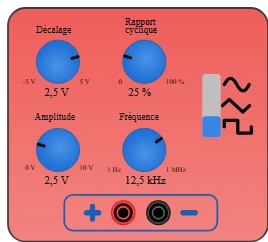

# 信号发生器

实验室的函数信号发生器：它输出 **自行变化的信号**，而 [实验室电源](alim.md) 输出的是固定电压。有三种波形可选 — **正弦波**、**三角波**、**方波** — 频率、幅度、偏置和占空比均可调。

只要电路需要 **用信号驱动** 而不是用电压驱动，就该拿出这台仪器：测量 RC 滤波器、放大器的响应、在输入端计数脉冲、用模数转换器采样正弦波。

元件栏类别：**测量仪器**。

## 引脚

| 端子 | 作用 |
|-------|------|
| **Vs** | **输出** 香蕉插座 — 信号（红色） |
| **GND** | **黑色** 香蕉插座 — 地，整个电路共用 |

两个插座相距 20 px（两个网格）。把 **Vs** 接到开发板的 **模拟输入**（`A0`…），程序就能读取信号；**GND** 必须接开发板的地，否则两台设备没有共同的参考点，读数毫无意义。

## 属性

| 属性 | 作用 | 默认值 |
|-----------|------|--------|
| `waveform` | 波形：正弦、三角或方波 | `sinus` |
| `frequency` | **频率** (Hz)，1 到 1 000 000，**精确到赫兹** | `1000` |
| `amplitude` | **峰峰值幅度** (V)，0 到 10，步长 **0.1** | `5` |
| `offset` | **直流偏置** (V)，−5 到 +5，步长 **0.1** | `0` |
| `duty` | **占空比** (%)，0 到 100，**精确到百分之一** | `50` |

> 这些值是 **初始** 状态：每次仿真启动时都会恢复。仿真期间转动旋钮不会修改项目 — 练习保留其原始设置。

幅度是 **峰峰值**，与真实信号发生器一样：它是信号从谷底到峰顶的 **总** 高度。因此 `amplitude = 5`、`offset = 0` 得到的曲线范围是 **−2.5 V 到 +2.5 V**；`offset = 2.5` 时范围是 **0 到 5 V**。幅度的一半分布在偏置的两侧。

刚拿出来的仪器 **偏置为零**：信号以地为中心，与实验台上一样。直接接到模拟输入上，它的整个负半周都会被 **削掉**（见下文）— 加偏置由你负责。

## 仿真时调节仪器

**四个旋钮** 用 **鼠标** 转动，就像真实仪器一样：按住旋钮并绕中心旋转。顺时针行程 **300°**；剩下的 60° 是 **死区**，旋钮会停在最近的一端。每个显示屏跟随其旋钮，并带单位。

右侧的 **滑块** 选择波形：上下 **拖动** 它 — 正弦在上，三角在中，方波在下。

编辑时旋钮 **不可用**：只有在仿真运行时才响应（编辑时单击用于移动仪器）。元件的缩放和旋转都会被考虑在内。

### 频率旋钮是对数刻度

它在 300° 内覆盖 **六个数量级**（1 Hz → 1 MHz）：因此行程是 **对数** 的，就像真实信号发生器刻度盘上刻的十倍程。大约每转五十度，频率乘以十。如果是线性行程，一度就对应 3300 Hz，低频段根本无法精细调节。

显示屏会写出合适的单位：`1 Hz`、`250 Hz`、`12.5 kHz`、`1 MHz`。

### 占空比同时影响方波和三角波

- **方波**：占空比是周期中处于 **高电平** 的比例。50 % 时信号对称；10 % 时是短脉冲；**0 %** 时一直为低，**100 %** 时一直为高 — 这是得到直流电压的两种方式。
- **三角波**：占空比决定 **上升** 段的长度。50 % 时三角波对称（峰值在周期中间）；90 % 时上升缓慢、下降陡峭 — 这就是 **锯齿波**。10 % 时锯齿方向相反。
- **正弦波**：占空比 **不起作用** — 变形的正弦波就不再是正弦波了。

## 开发板实际读到的内容

信号是在 **模数转换的准确时刻** 计算的，而不是每帧计算一次：在 1 MHz 时一个周期只有一微秒，每帧设定一次的值会落后数千个周期。循环调用 `analogRead` 的程序确实能看到波形。

注意 **削波**：模拟输入既读不到负电压，也读不到高于参考电压的值（Arduino 为 **5 V**，Pico 为 **3.3 V**）。10 V 峰峰值、无偏置的信号（即 −5 V 到 +5 V）会被 **削波** — 峰值处满量程，整个负半周为零，读到的波形与刻度盘上的完全不同。要保持在范围内，就要加偏置：例如在 Pico 上用 `amplitude = 3`、`offset = 1.65`（曲线范围为 0.15 V 到 3.15 V）。

## 用法

- **RC 滤波器**：Vs 接滤波器输入，滤波器输出接 `A0`，共地。转动频率旋钮读出衰减 — [绘图器](../USAGE.md) 会显示截止频率。
- **脉冲计数器**：方波，几赫兹，Vs 接数字输入。占空比改变脉冲宽度。
- **采样**：几十赫兹的正弦波，幅度和偏置调到开发板的范围中间，循环调用 `analogRead`。

---

*仪器图形由 Frank 为 Kablix 绘制。*
