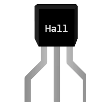

# 霍尔效应传感器

TO-92 封装的 **开关型** 磁场检测器（A3144、A3141、US1881…）。附近没有磁铁时输出处于释放状态；磁场一超过阈值，输出就 **拉到地**。转速计、非接触式限位开关和门关检测用的都是这种传感器。

## 引脚

| 引脚 | 作用 |
|--------|------|
| **V+** | 电源 (+) |
| **GND** | 地 |
| **S** | 数字输出，**开漏** 且 **低电平有效** |

不同型号的引脚排列各不相同：`V+`、`GND` 和 `S` 属性指明每个电极在哪只 **引脚**（1、2 或 3）上。名称始终不变 — 修改引脚排列永远不会使导线断开。

## 属性

| 属性 | 作用 | 默认值 |
|-----------|------|--------|
| `text` | 封装上的印字（每个换行印一行） | Hall |
| `V+` | 电源引脚编号 | 1 |
| `GND` | 地引脚编号 | 2 |
| `S` | 输出引脚编号 | 3 |
| `trigger` | 触发距离 (mm) | 10 |

## 仿真

- 仿真一开始，传感器旁边会出现一块 **磁铁**：**用鼠标拖动它** 靠近或远离。上方的标注显示距离；传感器翻转时线条变为 **绿色**。
- 距离小于触发距离（`trigger`）时，输出变为 **低电平**。超过时输出释放 — 由上拉电阻把它拉回高电平。
- **必须接上拉电阻**：可以用微控制器自带的（`pinMode(pin, INPUT_PULLUP)` 或 `Pin.IN, Pin.PULL_UP`），也可以在 S 与 + 电源轨之间接一个 10 kΩ 电阻。否则会提示 *“霍尔传感器输出需要上拉电阻”*，出问题的元件被红框标出，输出一直为低。
- 输出 **直接接到 + 电源轨**（0 Ω）就是短路：传感器要把一条它无法拉住的电源轨拉到地。同样的提示和红框。
- 传感器 **未供电**（V+ 或 GND 悬空）：同样的报告，完全不检测。

## 用法

- Arduino 接法：V+ 接 +5 V，GND 接地，S 接数字输入，S 与 +5 V 之间接 10 kΩ 电阻。`digitalRead(pin) == LOW` 表示 “有磁铁”。
- Pico 接法：V+ 接 3V3，GND 接地，S 接声明为 `Pin(n, Pin.IN, Pin.PULL_UP)` 的 GPIO — 无需外接电阻。
- **单极性** 传感器（A3144）只对一个磁极有反应：如果真实磁铁不能触发，把它翻过来试试。

---

*Kablix 自有元件 — 图形由 Frank Sauret 绘制。*
