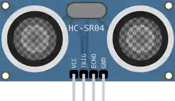

# HC-SR04 超声波传感器

超声波测距仪：通过飞行时间测量距离（2–400 cm）。

## 引脚

| 引脚 | 作用 |
|--------|------|
| **VCC** | 电源 (+5 V) |
| **TRIG** | 触发（脉冲） |
| **ECHO** | 回波（时长 ∝ 距离） |
| **GND** | 地 |

## 属性

| 属性 | 作用 | 默认值 |
|-----------|------|--------|
| `distance` | 模拟距离 (cm) | 20 |
| `distancemin` / `distancemax` | 距离滑块的范围 (cm) | 2 / 400 |
| `temperature` | 启动时的空气温度 (°C) | 20 |

## 用法

- 在 TRIG 上发一个 10 µs 的脉冲，测量 ECHO 的宽度（`pulseIn`、`time_pulse_us`）。
- 距离_cm = 时长_µs / 58。

## 仿真中：两个滑块

仿真运行时，元件上有 **两个设置**：

- 障碍物 **距离**（滑块 + 输入框，范围由 `distancemin`/`distancemax` 限定）；
- **空气温度**（−20 到 60 °C），它决定 **声速** — 提示气泡会显示相应的声速。

传感器从不直接测量距离：它测量的是往返的 **飞行时间**。程序通过除以一个常数来换算 — 58 µs/cm，**仅在 20 °C 时** 正确：

| 温度 | 声速 | 回波时长 | 除以 58 的程序读到的 100 cm |
|---|---|---|---|
| −20 °C | 319.2 m/s | 62.7 µs/cm | 108 cm |
| 0 °C | 331.3 m/s | 60.4 µs/cm | 104 cm |
| 20 °C | 343.4 m/s | 58.2 µs/cm | 100 cm |
| 60 °C | 367.7 m/s | 54.4 µs/cm | 94 cm |

仿真时移动温度滑块，障碍物会显得 **更近或更远**，尽管它并没有动：这就是需要补偿的误差。所用公式：`c = 331.3 + 0.606 × T`（m/s），然后 `时长 = 2 × 距离 / c`。

---

*本页根据 [Wokwi 文档](https://docs.wokwi.com/parts/wokwi-hc-sr04) 改编并翻译 — © Wokwi。`@wokwi/elements` 元件（MIT 许可证）。*
