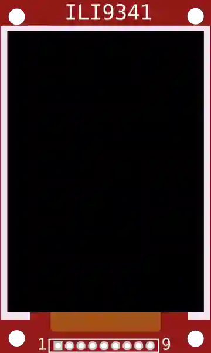

# TFT 显示屏 (ILI9341)

240×320 彩色 TFT 显示屏 (SPI)。可显示文字、图片和图形。

## 引脚

| 引脚 | 作用 |
|--------|------|
| **VCC / GND** | 电源 |
| **SCK / MOSI / MISO** | SPI 总线 |
| **CS** | 片选 |
| **D/C** | 数据/命令 |
| **RST** | 复位 |
| **LED** | 背光 |

## 用法

- SPI 总线。可用 Adafruit_ILI9341 / TFT_eSPI 库。
- 仿真时会解码并绘制画面。

---

*本页根据 [Wokwi 文档](https://docs.wokwi.com/parts/wokwi-ili9341) 改编并翻译 — © Wokwi。`@wokwi/elements` 元件（MIT 许可证）。*
