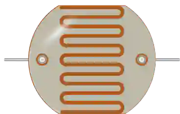

# LDR（光敏电阻）



**裸** 光敏电阻，两根引脚：光线越强，电阻越小。不要与 [光线传感器模块](photoresistor.md) 混淆，后者是一块完整的电路板（VCC/GND、模拟和数字输出）。

## 引脚

| 引脚 | 作用 |
|--------|------|
| **1** | 端子 1 |
| **2** | 端子 2（无极性） |

## 属性

| 属性 | 作用 | 默认值 |
|-----------|------|--------|
| `r1lx` | 1 lux 时的电阻 (Ω) | 50 000 |
| `gamma` | 灵敏度系数 (γ) | 0.7 |
| `lux` | 初始照度 (lux) | 500 |

## 仿真中

仿真时元件上会出现一个 **照度滑块**：它设置入射光线，从全暗到烈日。电阻遵循真实 LDR 的特性：

```
R = r1lx x lux^(-gamma)
```

使用默认值时：1 lx 下为 50 kΩ，500 lx（照明良好的房间）下约 650 Ω。黑暗中电阻上限为 10 MΩ。

## 用法

- 把 LDR 与一个固定电阻（通常 10 kΩ）接成 **分压器**，中点接模拟输入。
- ADC 读到的电压取决于你电路中实际的分压：不需要现成的模块也能得到可信的读数。
- 无极性元件：两根引脚没有区别。

---

*Kablix 元件 — 光度模型 `R = r1lx x lux^(-gamma)`。*
