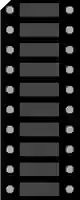

# LED 条形显示

由 10 个独立 LED 组成的条形显示（阳极 A1–A10，阴极 C1–C10）。

## 引脚

| 引脚 | 作用 |
|--------|------|
| **A1–A10** | 10 个 LED 的阳极 |
| **C1–C10** | 10 个 LED 的阴极 |

## 属性

| 属性 | 作用 | 默认值 |
|-----------|------|--------|
| `color` | 颜色（GYR = 绿/黄/红，或单色） | GYR |

## 用法

- 每个用到的 LED 都要串一个电阻。
- 适合做音量表 / 电平指示。

---

*本页根据 [Wokwi 文档](https://docs.wokwi.com/parts/wokwi-led-bar-graph) 改编并翻译 — © Wokwi。`@wokwi/elements` 元件（MIT 许可证）。*
