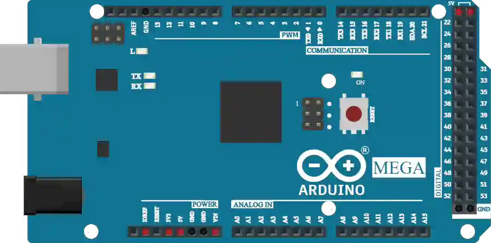

# Arduino Mega 2560

ATmega2560 开发板：54 个数字 I/O（15 个 PWM）、16 个模拟输入、4 个 UART。

## 引脚

| 引脚 | 作用 |
|--------|------|
| **0–53** | 数字 I/O |
| **A0–A15** | 模拟输入 |
| **5V / 3.3V / VIN** | 电源 |
| **GND** | 地 |

## 用法

- 适合需要大量引脚的项目。
- 用 **K** 按钮查看完整引脚图。

---

*本页根据 [Wokwi 文档](https://docs.wokwi.com/parts/wokwi-arduino-mega) 改编并翻译 — © Wokwi。`@wokwi/elements` 元件（MIT 许可证）。*
