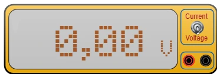

# 万用表



带两个香蕉插座的测量仪器。**拨动开关** 选择测量内容：拨杆 **向上** = **直流电流**（电流表），拨杆 **向下** = **直流电压**（电压表）。显示屏显示读数和单位，与真实仪器一样。

元件栏类别：**测量仪器**。

## 引脚

| 端子 | 作用 |
|-------|------|
| **+** | **红色** 香蕉插座 — 电流输入端，或被测电压的高电位点 |
| **GND** | **黑色** 香蕉插座 — 返回端 |

两个插座相距 20 px（两个网格）。如果读数为 **负**，说明两根表笔接反了 — 与真实仪器一样，这不是接线错误，只是符号不同。

## 属性

| 属性 | 作用 | 默认值 |
|-----------|------|--------|
| `mode` | 测量：`voltage`（直流电压）或 `current`（直流电流） | `voltage` |

**任何时候** 都可以在面板中选择模式，也可以在 **仿真时** 单击拨动开关切换。切换模式会清空显示：把安培当作伏特读是没有意义的。

## 电压表：并联

电压表测量两个插座之间的 **电位差**。它 **跨接** 在被测对象两端，不需要断开任何东西：

- 跨接在电阻、LED、电池两端；
- 接在开发板引脚与地之间。

它不消耗任何电流：电路的表现与没有接仪器时完全一样。因此可以一直接着，不会影响任何测量结果。

## 电流表：串联

电流表计量 **流过** 其插座的电流。因此必须 **断开电路**，把它插到断口中，放在你要测电流的支路里：

```
+5 V ──── R 1 kΩ ──── [+ 万用表 GND] ──── GND
```

在电气上，电流表就是 **一根导线**：它的两个插座是电路中的同一个点。正因如此，电流流过它时，测量本身不会改变任何东西。

> **注意 — 经典陷阱。** 把电流表 **跨接** 在电源两端（像接电压表那样）会 **使电源短路**：相当于一根导线直接把正极连到负极。Kablix 会用红框标出该元件，并在状态栏中提示。在真实仪器上，这时保险丝会烧断。

## 显示内容

- **电压**：`12.3 V`、`0.00 V`、`-5.00 V`。
- **电流**：小于一安培时以 **毫安** 显示（`4.99 mA`），大于时以安培显示（`1.25 A`）。
- 最多四位有效数字：小于 10 时两位小数，小于 100 时一位小数，更大时没有小数 — 就像三位半数字表。
- 插座 **悬空**（什么都没接）：显示保持为零。

## 用法

- 要 **测电压**，保持电路不变，把两个插座接到要比较的两个点上。
- 要 **测电流**，剪断你关心的那条支路的导线，把万用表接在剪掉的那一段的位置上。
- 读数在仿真的每一帧都会刷新：能跟上 LED 点亮、电机启动、电位器转动。
- 仿真之外显示屏是熄灭的，开关也不能拨动 — 此时单击用于选择和移动仪器。

---

*仪器图形由 Frank 为 Kablix 绘制。*
