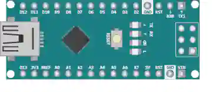

# Arduino Nano

小巧的 ATmega328P 开发板（与 Uno 同一内核），可直接插在面包板上。

## 引脚

| 引脚 | 作用 |
|--------|------|
| **0–13** | 数字 I/O（~ = PWM） |
| **A0–A7** | 模拟输入 |
| **5V / 3.3V / VIN** | 电源 |
| **GND** | 地 |

## 用法

- 功能与 Uno 相同，体积更小。
- A6/A7：只能作模拟输入。

---

*本页根据 [Wokwi 文档](https://docs.wokwi.com/parts/wokwi-arduino-nano) 改编并翻译 — © Wokwi。`@wokwi/elements` 元件（MIT 许可证）。*
