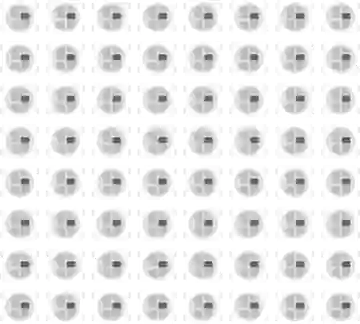

# NeoPixel 点阵

可寻址 RGB LED (WS2812) 点阵，只用一根数据线控制。

## 引脚

| 引脚 | 作用 |
|--------|------|
| **VCC** | 电源 (+) |
| **GND** | 地 |
| **DIN** | 数据输入 |
| **DOUT** | 数据输出 |

## 属性

| 属性 | 作用 | 默认值 |
|-----------|------|--------|
| `rows` | 行数 | 8 |
| `cols` | 列数 | 8 |

## 用法

- DIN 接数字引脚。
- 像素编号取决于接线方式，通常呈蛇形排列。

---

*本页根据 [Wokwi 文档](https://docs.wokwi.com/parts/wokwi-neopixel-matrix) 改编并翻译 — © Wokwi。`@wokwi/elements` 元件（MIT 许可证）。*
