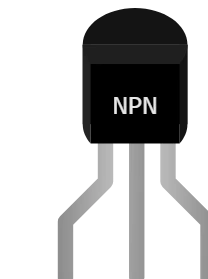

# 三极管 NPN（通用）

**NPN** 双极型三极管的原型：封装、印字、增益和引脚排列都在属性中设置。适用于还没有专门帮助页的任何型号（BC547、2N3904、S8050…）。

## 引脚

引脚按图形顺序命名为 **1**、**2** 和 **3** — 而不是 E/B/C。因此修改电极分配不会重命名任何引脚，**导线永远不会断开**。

| 引脚 | 作用 |
|--------|------|
| **1** | 第一只引脚（默认为发射极） |
| **2** | 第二只引脚（默认为基极） |
| **3** | 第三只引脚（默认为集电极） |

## 属性

| 属性 | 作用 | 默认值 |
|-----------|------|--------|
| `pkg` | 元件封装 | TO-92 |
| `e` | 发射极所在引脚（1、2 或 3） | 1 |
| `b` | 基极所在引脚（1、2 或 3） | 2 |
| `c` | 集电极所在引脚（1、2 或 3） | 3 |
| `gain` | 电流增益 β（1 位小数） | 100 |
| `text` | 封装上的印字（每输入一行印一行） | NPN |
| `vcemax` | Vce 最大值 (V) | 40 |
| `icmax` | Ic 最大值 (A) | 0.6 |

一只引脚只能对应 **一个** 电极：把发射极分配给已被集电极占用的引脚时，两者会 **互换**。

## 仿真

- 当 **基极为高电平、发射极为低电平** 时导通。
- 它能通过的电流上限为 **增益 × Ib**：要让它饱和，否则下游电路无法工作。
- 实际引脚排列取决于型号：正面看 BC547 是 C-B-E (1-2-3)，TO-92 封装的 2N2222 是 E-B-C。`e`、`b`、`c` 属性正是为此而设。

## 用法

- 用 `text` 在封装上写型号：每输入一行印一行（先 “BC” 再 “547” 就会在元件上印两行）。
- 要导入你自己的图形，请使用 **元件创建器**（仿真模型选 “双极型三极管”）。

---

*Kablix 自有元件 — 图形由 Frank Sauret 绘制。*
