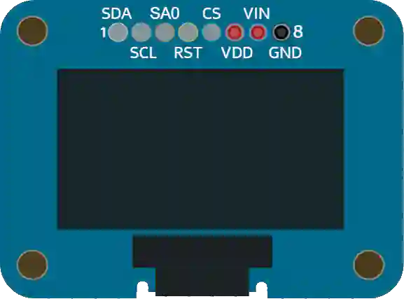

# OLED 显示屏 (SSD1306)

128×64 单色小型 OLED 显示屏 (SPI)。非常适合显示文字和图形。

## 引脚

| 引脚 | 作用 |
|--------|------|
| **VIN** | 电源 (+) |
| **GND** | 地 |
| **CLK** | SPI 时钟 (SCK) |
| **DATA** | SPI 数据 (MOSI) |
| **DC** | 数据/命令 |
| **CS** | 片选 |
| **RST** | 复位 |

## 用法

- SPI 总线 + DC + CS。可用 Adafruit_SSD1306 / U8g2 库。
- 仿真时会解码显存并绘制画面。

---

*本页根据 [Wokwi 文档](https://docs.wokwi.com/parts/wokwi-ssd1306) 改编并翻译 — © Wokwi。`@wokwi/elements` 元件（MIT 许可证）。*
