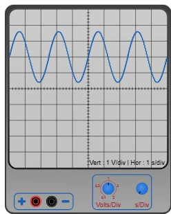

# 示波器



带两个香蕉插座的测量仪器，与 [万用表](multimetre.md) 类似 — 但它不是显示一个数字，而是 **画出电压随时间的变化**。屏幕上有 **10 × 10** 的网格，两条坐标轴穿过中心。两个旋钮设定一格的大小：一个管高度（伏特），一个管宽度（时间）。

元件栏类别：**测量仪器**。

## 引脚

| 端子 | 作用 |
|-------|------|
| **+** | **红色** 香蕉插座 — 要观察其电压的点 |
| **GND** | **黑色** 香蕉插座 — 参考点 |

两个插座相距 20 px（两个网格）。示波器 **并联** 在你要观察的对象两端，与电压表完全一样：跨接在电阻、LED 两端，或接在开发板引脚与地之间。它不消耗电流，电路的表现就像它不存在一样。

如果波形向下而不是向上，说明两根表笔接反了 — 这不是接线错误，只是符号不同。

## 属性

| 属性 | 作用 | 默认值 |
|-----------|------|--------|
| `voltsdiv` | 一格的高度，单位伏特：`0.1`、`0.5`、`1`、`2` 或 `5` | `1` |
| `sdiv` | 一格的宽度，单位秒 — **任意数值** | `1` |
| `trigger` | **触发** 电压，单位伏特。**留空** = 自动设定 | *（空）* |
| `triggeredge` | 由哪种边沿触发：`rising`（上升沿）或 `falling`（下降沿） | `rising` |

这两个参数随时可在面板中设置，**仿真时也可以用鼠标在旋钮上调节**。

## 两个旋钮

每 **单击** 一次旋钮转动一档：单击 **右半边** 向右转，单击 **左半边** 向左转。鼠标 **滚轮** 也可以。

- **Volts/Div**（左旋钮）：有五个档位，每格 `0.1 · 0.5 · 1 · 2 · 5` 伏，两端有 **止档**。数值越小，波形越高。屏幕在轴上方有 5 格，下方有 5 格：1 V/div 时显示 −5 V 到 +5 V。
- **s/Div**（右旋钮）：**没有止档**，想转多久都行。向 **右** 转波形 **展开**（每格秒数更少，可看清细节）；向 **左** 转波形 **压缩**（可看到更长的时间段）。转一整圈是 **10** 倍，即八档。没有 `1-2-5` 列表：中间值也存在（`1.33 s/div`、`562 ms/div`…）。

**屏幕下方** 的说明文字显示两个量程和触发电压，使用最直观的单位：

```
Vert: 2 V/div
Hor: 500 ms/div
Trig: 0.8 V
```

## 触发

没有触发时，重复的波形会 **不停地滑动**：每一帧都从偶然停下的地方开始，一个完全稳定的方波看起来也像在屏幕上奔跑。触发就像把电影胶片重新对准同一帧：仪器沿时间往回寻找信号 **以指定方向穿过指定电压** 的最后一个位置，并把 **这个点** 放在屏幕的左边缘。这样波形总是画在同一个位置，稳定不动。

- **光标** — 贴在屏幕 **左** 边缘的蓝色小三角 — 表示 **电压**。仿真时可以 **用鼠标抓住它** 上下移动；说明文字随之变化（`Trig: …`）。只要你不动它，它会自动停在 **信号的中间高度**，这几乎适用于所有情况（方波、正弦波、锯齿波）。
- 图形右下角的 **小旋钮** 选择 **方向**：蓝色半边 **朝上** = **上升** 沿（信号上升时穿过），**朝下** = **下降** 沿。单击一次即可切换。

如果信号从不穿过这个电压 — 稳定的直流电压，或光标拉得太高 — 就没有可以对准的点：波形会像之前一样 **重新滚动**。这说明需要把光标拉回到信号范围内。

## 屏幕显示的内容

- 无法触发时，波形 **向左滚动**：现在在 **右** 边缘，过去从左边离开。可见宽度为 **10 格**，即水平量程的十倍。
- 显示的时间是 **程序** 的时间，而不是墙上时钟的时间。仿真减速时，波形画得更慢，但比例尺保持正确。
- 过高的信号会在屏幕 **边缘被截断**，与真实仪器一样：降低垂直量程（选更大的数值）让它显示完整。
- 插座 **悬空**（什么都没接）：波形停止。
- **仿真开始时屏幕会清空**：每次运行都从干净的波形开始。
- 仿真之外屏幕是空的，旋钮也不能转动 — 此时单击用于选择和移动仪器。

> **它做不到的事。** 仪器 **每帧只取一个点**，即每秒约 60 个。它非常适合显示 **慢速** 变化：LED 点亮、电容充电、转动电位器、以几赫兹闪烁的信号。它 **不能** 显示快速信号的形状（500 Hz 的 PWM、串口数据帧）：只能随机抓到其中几个点。

## 用法

- 把两个插座接到要比较的两个点上，启动仿真，先调 **Volts/Div** 让波形能完整显示在屏幕上，再调 **s/Div** 查看你关心的部分。
- 信号在重复但波形在屏幕上跑：需要调整 **触发** — 把光标拉到信号中间。
- 观察电容充电时，用 1 V/div，每格几百毫秒。
- 观察缓慢变化的电压（传感器、电位器）时，调到每格几秒：屏幕就变成了记录仪。

---

*仪器图形由 Frank 为 Kablix 绘制。*
