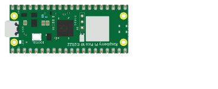

# Raspberry Pi Pico 2 W



与 Pico 2 完全相同（RP2350、双核 Cortex-M33 150 MHz、3.3 V、引脚相同），另带一个 **Wi-Fi/蓝牙** 模块。物理引脚与 Pico 一致。

## 引脚

| 引脚 | 作用 |
|--------|------|
| **GP0–GP28** | 数字 I/O（GP26–GP28 = ADC0–ADC2） |
| **3V3** | 3.3 V 输出 |
| **VSYS / VBUS** | 输入电源 |
| **GND** | 地 |
| **RUN** | 复位（低电平有效） |

## 用法

- 用 **K** 按钮查看完整引脚图。
- **3.3 V** 逻辑电平（不耐受 5 V）。
- 可用 **MicroPython** 编程：Kablix 加载 `RPI_PICO2_W` 固件。
- 内核 **没有仿真** Wi-Fi：网络请求通过主机转发 — 见下文 *与外部世界通信*。

> ℹ️ 这块板暂不支持裸机 C/C++：请使用 MicroPython，或用 Pico W 运行 Arduino 程序。


## 与外部世界通信

Wi-Fi 芯片 (CYW43439) **没有被仿真**：它在仿真内核中并不存在。Kablix 用一个 **网络桥** 代替它 — 脚本与扩展通信，由扩展在你的电脑上发出真实请求并返回响应。因此程序仍然与真实开发板上的一样：

```python
import network, urequests, time

wlan = network.WLAN(network.STA_IF)
wlan.active(True)
wlan.connect("my-ssid", "my-password")         # 原样接受，立即连接成功
while not wlan.isconnected():
    time.sleep(0.1)
print(wlan.ifconfig())                         # ('192.168.1.50', ...)：一个 “门面” 地址

r = urequests.get("https://api.github.com/repos/FrankSAURET/kablix")
print(r.status_code, r.json()["name"])
r.close()
```

哪些是真的，哪些不是：

- `network.WLAN` 只是一个 **门面**：`connect()` 总是成功（SSID 和密码被忽略），`isconnected()` 变为真，`ifconfig()` 返回一个固定地址。从不发送任何 Wi-Fi 数据包。
- `urequests`（别名 `requests`）会发出 **真实的 HTTP 请求**，由 VS Code 执行：`get`、`post`、`put`、`patch`、`delete`、`head`，支持 `data=`、`json=` 和 `headers=`。响应包含 `status_code`、`reason`、`text`、`content` 和 `.json()`。
- 只转发 **http://** 和 **https://**，超时时间 15 秒，响应体最大 **64 KB**：隧道借用仿真的串口链路，速度较慢。
- **客户端** `socket`（对外连接）不转发，MQTT 和蓝牙也不转发：请使用 `urequests`。而 **服务器** `socket` 可以工作 — 见下文。
- 要切断所有对外访问：在设置中取消勾选 **`kablix.picowNetworkBridge`**（默认开启）。此时脚本会收到 `OSError`。


### 接入点和 Web 服务器

经典的做法 — 开发板声明自己是 **接入点**，手机连上它，通过网页控制 LED — 可以使用，但有一点不同：持有 TCP 套接字的是 **你的电脑**，而不是开发板。不会创建任何 Wi-Fi 网络：手机留在 **与电脑相同的网络** 中，打开启动时公布的地址。

```python
import network, socket
from machine import Pin

led = Pin(15, Pin.OUT)

ap = network.WLAN(network.AP_IF)
ap.config(essid="Kablix-Pico", password="kablix2026")
ap.active(True)
print("Address:", ap.ifconfig()[0])           # 电脑的真实地址

address = socket.getaddrinfo("0.0.0.0", 80)[0][-1]
server = socket.socket()
server.bind(address)
server.listen(1)

while True:
    client, _ = server.accept()
    request = client.recv(1024).split(b"\r\n")[0].decode()
    if "/on" in request:
        led.value(1)
    elif "/off" in request:
        led.value(0)
    client.send("HTTP/1.1 200 OK\r\n\r\n<a href='/on'>ON</a> <a href='/off'>OFF</a>")
    client.close()
```

- `network.WLAN(network.AP_IF)` 只是一个 **门面**：`config(essid=…, password=…)` 会被接受并记住，`active(True)` 成功，但不会广播任何接入点。不过 `ifconfig()[0]` 返回的是你电脑的 **真实 IPv4 地址** — 手机上要打开的就是这个地址。
- **服务器** `socket` 是真实转发的：`getaddrinfo`、`bind`、`listen`、`accept`、`recv`/`read`/`readline`、`send`/`sendall`/`write`、`makefile`、`close`。字节原样往返 — 说 HTTP 的是你的程序，与真实开发板完全一样。
- **请求的端口不一定能得到**：大多数电脑上 80 端口是保留的。这时 Kablix 会改用 8080，再不行就用任意空闲端口，并在控制台打印打开的地址：`[Kablix] Pico W server: http://…`。要访问的就是 **这个** 地址，而不是程序中的端口。
- 第一次运行时，**防火墙** 会请求许可：请允许专用网络访问，否则手机会敲一扇空门。
- 仿真停止时套接字关闭；**`kablix.picowNetworkBridge`** 设置也会切断它（脚本会收到 `OSError`）。
- 现成的测试电路：`testkablix/wifi-picow.projix`（及其孪生版本 `testkablix/wifi-pico2w.projix`）。

---

*Kablix 自有元件。开发板图形依据 Raspberry Pi Ltd 官方图纸。RP2350 © Raspberry Pi Ltd。*
