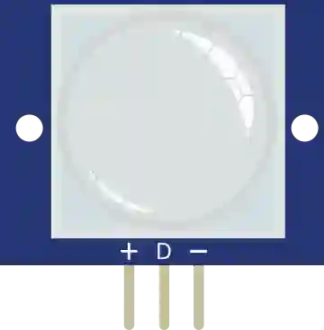

# PIR 人体传感器

被动式红外运动检测器。检测到运动时数字输出变为高电平。

## 引脚

| 引脚 | 作用 |
|--------|------|
| **VCC** | 电源 (+) |
| **OUT** | 数字输出（1 = 有运动） |
| **GND** | 地 |

## 属性

无：仿真时 **用鼠标** 触发运动（见下文）。

## 用法

- OUT 接数字输入。

## 仿真中：用鼠标制造运动

- **在传感器上移动鼠标** → OUT 变为 1。起作用的是 *运动*，而不仅仅是指针在那里：鼠标停下后不久，输出会回到 0。
- 在传感器上 **Ctrl+单击** → **持续** 运动（OUT 保持为 1，即使鼠标移开）。再次 Ctrl+单击即可停止。
- 一个 **提示气泡** 会提醒这些操作：它出现在 **指针下方 25 px** 处，以指针为中心，绝不会挡住传感器。只要鼠标悬停在传感器上，即使不动，它也一直可见，并且 **无论工作区如何缩放**，其大小和与指针的距离都保持不变。

---

*本页根据 [Wokwi 文档](https://docs.wokwi.com/parts/wokwi-pir-motion-sensor) 改编并翻译 — © Wokwi。`@wokwi/elements` 元件（MIT 许可证）。*
