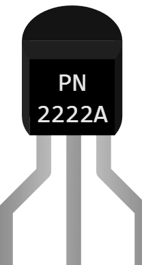

# 三极管 PN2222A (NPN)

TO-92 封装的小信号 NPN 双极型三极管。在 Kablix 中它是一个 **受控开关**：基极电流可以让最多 35 倍大的集电极电流通过。

## 引脚

| 引脚 | 作用 |
|--------|------|
| **E** | 发射极 — 经典电路中接地 |
| **B** | 基极 — 控制端，一定 要串联电阻 |
| **C** | 集电极 — 接被开关的负载（继电器、电机、LED） |

## 属性

| 属性 | 作用 | 默认值 |
|-----------|------|--------|
| `angle` | 方向 (0/90/180/270°) | 0 |

PN2222A 是一个固定型号：增益 35，Vce 最大 40 V，Ic 最大 600 mA。如果想自己设置这些数值，请使用 **通用 NPN 三极管**。

## 仿真

- 当 **基极为高电平、发射极为低电平** 时三极管导通。
- 它能通过的电流上限为 **增益 × Ib**（35 × Ib）：这就是全部模型。因此要让它 **饱和** — 如果下游电路需要更大的电流，就无法工作（风扇不转，继电器不吸合）。
- 基极 **不加电阻** 直接连接时总是饱和…… 但会烧坏真实的三极管：请加基极电阻。

## 用法

- 典型数值：要驱动 40 mA 的继电器线圈，需要 Ib ≥ 40 / 35 ≈ 1.2 mA。在 5 V 下，1 kΩ 基极电阻提供 (5 − 0.7) / 1000 ≈ 4.3 mA：充分饱和。
- 基极电阻太大（100 kΩ）→ Ib = 43 µA → Ic 最大 ≈ 1.5 mA：负载永远启动不了。这是仿真中要留意的典型错误。
- 驱动继电器时 **必须加续流二极管**（阴极朝 +）：否则断电时的尖峰会损坏三极管。

---

*Kablix 自有元件 — 图形由 Frank Sauret 绘制。*
