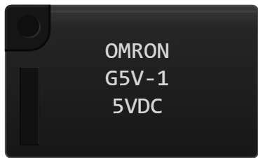

# 继电器 OMRON G5V

单刀双掷 (SPDT) 电磁继电器（一组转换触点）。线圈在额定电压下吸合衔铁，使公共端从 **常闭** 触点切换到 **常开** 触点。它把控制侧（开发板）与功率侧（灯、电机、市电……）完全隔离。

## 引脚

| 引脚 | 作用 |
|--------|------|
| **B1** | 线圈第一个端子（无极性） |
| **B2** | 线圈第二个端子 |
| **NF** | **常闭** 触点（释放位置） |
| **NO** | **常开** 触点（吸合位置） |
| **Com** | 衔铁公共端 — 从外壳两侧引出，是 **同一个** 引脚 |

两个 “Com” 焊盘在电气上完全相同：接哪一个都一样，选布线更方便的那个即可。

## 属性

| 属性 | 作用 | 默认值 |
|-----------|------|--------|
| `voltage` | 线圈电压：3、5、6、9、12 或 24 V | 5 |
| `angle` | 方向 (0/90/180/270°) | 0 |

所选电压会 **印在外壳上**（“5VDC”），与真实元件一样。

## 仿真

- 当线圈得到的电压至少达到 **额定电压的 80 %**（“动作电压”），并且电源能提供其电流（5 V G5V 约 40 mA）时，线圈吸合。
- 电压不足 → 继电器 **不工作**，公共端停在 NF。
- B1 与 B2 之间 **必须接续流二极管**，**阴极朝电源 +**。没有它会提示 *“必须加续流二极管”*；接反了则提示 *“二极管接反了”* — 两种情况下继电器都不会吸合。
- 每条消息都会 **指出出问题的元件**（“(Mod2)”），**并在电路图上用红框框出它**，大小与选择框相同：不用再找是哪个继电器要改。故障修复后以及仿真停止时，红框会消失。
- 红框旁边会出现一个 **红底黄字的标签，解释问题** 以及如何修改（例如：*“继电器线圈是电感：切断电流时会产生反向高压，损坏驱动三极管。续流二极管用来吸收它 — 这不是可选项。”*）。只在仿真运行时显示。
- 开发板输出：一个引脚只能提供 40 mA。直接驱动线圈勉强可行；正确的电路是在线圈与地之间加一个 **三极管**（PN2222A）。

## 用法

- 典型电路：单片机引脚 → 1 kΩ 电阻 → PN2222A 基极；发射极接地；集电极接 B2；B1 接 +5 V；二极管接在 B1（阴极）和 B2（阳极）之间。
- **NF** 触点用于失效安全电路：所有设备断电时，电路已经是闭合的。

---

*Kablix 自有元件 — 图形由 Frank Sauret 绘制。*
