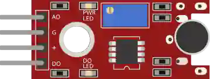

# 声音传感器

带比较器的麦克风。带模拟（音量）和数字（阈值）输出。

## 引脚

| 引脚 | 作用 |
|--------|------|
| **VCC** | 电源 (+) |
| **GND** | 地 |
| **AOUT** | 模拟输出 |
| **DOUT** | 数字输出（阈值） |

## 属性

| 属性 | 作用 | 默认值 |
|-----------|------|--------|
| `state` | 检测到声音 (0/1) | 0 |

## 用法

- DOUT 接数字输入，AOUT 接模拟输入。
- 在真实模块上调节阈值。

---

*本页根据 [Wokwi 文档](https://docs.wokwi.com/parts/wokwi-small-sound-sensor) 改编并翻译 — © Wokwi。`@wokwi/elements` 元件（MIT 许可证）。*
