# Composants Kablix

Bibliothèque publique de composants Kablix au format **.kompix**.

## Format .kompix

Fichier ZIP contenant :
- `manifest.json` : métadonnées du composant
- `schema.svg` : dessin externe et optionnel schéma interne
- `thumbnail.webp` : miniature optionnelle
- `behavior.mjs` : code de simulation optionnel
- `help/<lang>.md` : fiche d'aide du composant, ouverte par le bouton **Aide du composant** du volet des propriétés (ses illustrations sont posées à côté)

Voir [kompix_specification.md](../docs/kompix_specification.md) pour les détails.

## Créer un composant

| Guide | Ce qu'il couvre |
|---|---|
| [Créer ses propres composants](../docs/fr/USAGE.md#créer-ses-propres-composants) | Le créateur intégré (bouton **+ Créer un composant**), sans toucher au code |
| [Créer un composant Kablix](../docs/fr/Creating-components.md) | La chaîne complète d'un composant **intégré au dépôt** : dessin, extraction, élément, catalogue, simulation, tests, fiche d'aide |
| [Modifier les SVG des composants](../docs/fr/Editing-svg-components.md) | Retoucher un dessin, un schéma interne, la grille de 10 px et les pastilles de broches |
| [Dessiner les systèmes en volume](../docs/fr/Drawing-systems.md) | Les pièces mises en volume par le moteur isométrique : profils, assemblages, pattes |
| [Format .kompix](../docs/kompix_specification.md) | La spécification du paquet : manifeste, SVG, comportement, aide, traductions |

Deux scénarios de bout en bout, dessin compris :
- [Créer un composant 2D.md](../Créer%20un%20composant%202D.md) — une carte moteur Joy-it SBC-MotoDriver3 (I²C, 4 moteurs)
- [Créer un composant 3D.md](../Créer%20un%20composant%203D.md) — un petit véhicule découpé en PMMA (Pico, carte moteur, 4 roues)

## Composants disponibles

Composants de cette bibliothèque, à installer depuis Kablix (**⚙ Gérer les composants**).

<strong>9 composant(s) à télécharger</strong>

| | Type | Label | Version | Catégorie | Description |
|---|------|-------|---------|-----------|-------------|
| 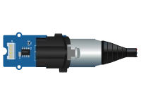 | `dmx-grove` | Grove DMX512 | 2026.9.1 | Misc | Grove DMX512 shield (SP3485 line driver): turns the board UART into a DMX512 output on a 3-pin XLR socket. |
| 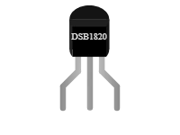 | `ds18b20` | Temperature sensor DS18B20 (TO-92) | 2026.9.2 | Sensors | Dallas DS18B20 digital temperature sensor (-55 to +125 °C, ±0.5 °C): it talks over a single data wire… |
| 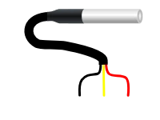 | `ds18b20-etanche` | Temperature sensor DS18B20 (waterproof probe) | 2026.9.2 | Sensors | Dallas DS18B20 digital temperature sensor (-55 to +125 °C, ±0.5 °C): it talks over a single data wire… |
| 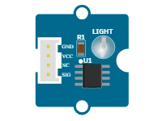 | `grove-light-sensor` | Grove light sensor | 2026.9.1 | Sensors | Grove ambient light sensor (LS06-S phototransistor): the analog output rises with the light falling on it. In… |
| 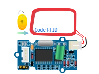 | `grove-rfid` | Grove 125 kHz RFID reader | 2026.9.1 | Sensors | Grove 125 kHz RFID reader (EM4100 tags): while a tag sits in the antenna loop the module keeps sending its… |
| 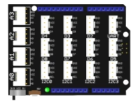 | `grove-uno` | Grove Shield (Uno) | 2026.9.1 | Boards | Grove Base Shield V2 for Arduino Uno: 16 Grove sockets (4 analog, 7 digital, 4 I2C, 1 UART) wired to the… |
| 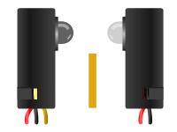 | `ir-barrier` | Through-beam IR barrier | 2026.9.0 | Sensors | Through-beam infrared barrier (emitter + receiver): while the beam reaches the receiver its output transistor… |
| 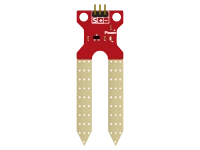 | `soil-moisture-sensor` | Soil moisture sensor | 2026.9.1 | Sensors | Resistive soil moisture probe (two prongs): wet soil conducts, so the analog output rises with moisture. In… |
| 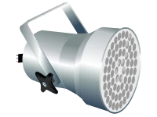 | `spot` | DMX PAR 38 spotlight | 2026.9.0 | Systems | PAR 38 LED spotlight driven over DMX512 (Contest): the LED array takes the colour sent on its channels. |

## Composants inclus dans Kablix

Déjà livrés avec l'extension : rien à télécharger, ils sont dans la palette. **À consulter avant d'en dessiner un nouveau.**

<strong>76 composant(s) livrés</strong>

| | Type | Label | Catégorie | Description |
|---|------|-------|-----------|-------------|
|  | `74xx00` | [74xx00 — quadruple porte NON-ET à 2 entrées](../docs/fr/composants/74xx00.md) | Circuits intégrés | Boîtier DIL-14 à enficher sur la platine d'essai : quatre portes NON-ET indépendantes, chacune avec ses deux… |
|  | `74xx02` | [74xx02 — quadruple porte NON-OU à 2 entrées](../docs/fr/composants/74xx02.md) | Circuits intégrés | Boîtier DIL-14 à enficher sur la platine d'essai : quatre portes NON-OU indépendantes, chacune avec ses deux… |
| 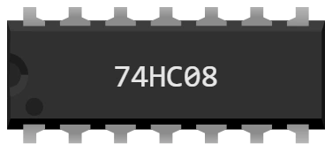 | `74xx08` | [74xx08 — quadruple porte ET à 2 entrées](../docs/fr/composants/74xx08.md) | Circuits intégrés | Boîtier DIL-14 à enficher sur la platine d'essai : quatre portes ET indépendantes, chacune avec ses deux… |
|  | `74xx14` | [74xx14 — sextuple inverseur à trigger de Schmitt](../docs/fr/composants/74xx14.md) | Circuits intégrés | Boîtier DIL-14 à enficher sur la platine d'essai : six inverseurs indépendants. Un inverseur sort l'inverse… |
| 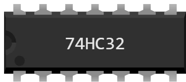 | `74xx32` | [74xx32 — quadruple porte OU à 2 entrées](../docs/fr/composants/74xx32.md) | Circuits intégrés | Boîtier DIL-14 à enficher sur la platine d'essai : quatre portes OU indépendantes, chacune avec ses deux… |
|  | `74xx86` | [74xx86 — quadruple porte OU EXCLUSIF à 2 entrées](../docs/fr/composants/74xx86.md) | Circuits intégrés | Boîtier DIL-14 à enficher sur la platine d'essai : quatre portes OU EXCLUSIF indépendantes, chacune avec ses… |
|  | `7seg` | [Afficheur 7 segments](../docs/fr/composants/7seg.md) | Afficheurs | Afficheur à 7 segments (+ point décimal) pour chiffres et symboles simples. 1 à 4 digits, cathode ou anode… |
| 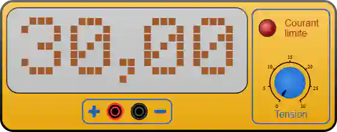 | `alim` | [Alimentation de laboratoire](../docs/fr/composants/alim.md) | Appareils de mesure | Source de tension continue réglable de 0 à 30 V, avec limitation de courant. Elle alimente un montage sans… |
|  | `araignee` | [Robot araignée](../docs/fr/composants/araignee.md) | Système | Robot quadrupède complet : un châssis et 4 pattes à 2 articulations (coxa et patella), soit 8 servomoteurs… |
| 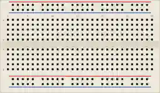 | `breadboard` | [Platine d'essai (breadboard)](../docs/fr/composants/breadboard.md) | Cartes & platines | Plaque de prototypage sans soudure. Les trous sont reliés par bandes pour connecter les composants en… |
|  | `button` | [Bouton poussoir](../docs/fr/composants/button.md) | Commandes | Bouton tactile 12 mm momentané. Au repos le circuit est ouvert ; appuyé, il relie ses deux contacts. |
| 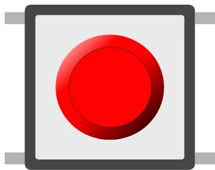 | `button-6mm` | [Bouton poussoir (6 mm)](../docs/fr/composants/button-6mm.md) | Commandes | Petit bouton tactile 6 mm, même fonctionnement que le bouton 12 mm. |
| 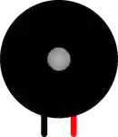 | `buzzer` | [Buzzer](../docs/fr/composants/buzzer.md) | Actionneurs | Buzzer piézo actif : émet un son tant qu'une tension est appliquée entre ses bornes. |
|  | `cd4001` | [CD4001 — quadruple porte NON-OU à 2 entrées](../docs/fr/composants/cd4001.md) | Circuits intégrés | Boîtier DIL-14 à enficher sur la platine d'essai : quatre portes NON-OU indépendantes, chacune avec ses deux… |
|  | `cd40106` | [CD40106 — sextuple inverseur à trigger de Schmitt](../docs/fr/composants/cd40106.md) | Circuits intégrés | Boîtier DIL-14 à enficher sur la platine d'essai : six inverseurs indépendants. Un inverseur sort l'inverse… |
| 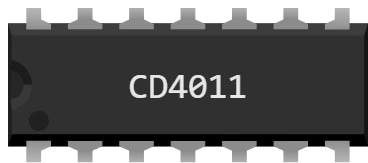 | `cd4011` | [CD4011 — quadruple porte NON-ET à 2 entrées](../docs/fr/composants/cd4011.md) | Circuits intégrés | Boîtier DIL-14 à enficher sur la platine d'essai : quatre portes NON-ET indépendantes, chacune avec ses deux… |
|  | `cd4070` | [CD4070 — quadruple porte OU EXCLUSIF à 2 entrées](../docs/fr/composants/cd4070.md) | Circuits intégrés | Boîtier DIL-14 à enficher sur la platine d'essai : quatre portes OU EXCLUSIF indépendantes, chacune avec ses… |
| 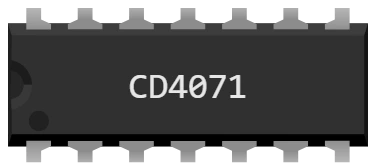 | `cd4071` | [CD4071 — quadruple porte OU à 2 entrées](../docs/fr/composants/cd4071.md) | Circuits intégrés | Boîtier DIL-14 à enficher sur la platine d'essai : quatre portes OU indépendantes, chacune avec ses deux… |
| 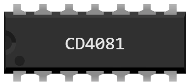 | `cd4081` | [CD4081 — quadruple porte ET à 2 entrées](../docs/fr/composants/cd4081.md) | Circuits intégrés | Boîtier DIL-14 à enficher sur la platine d'essai : quatre portes ET indépendantes, chacune avec ses deux… |
|  | `condo-np` | [Condensateur non polarisé](../docs/fr/composants/condo-np.md) | Discrets | Condensateur film plastique, sans polarité. En série avec une résistance, il forme un circuit RC : la tension… |
|  | `dht11` | [Capteur température/humidité DHT11](../docs/fr/composants/dht11.md) | Capteurs | Capteur numérique 1-wire de température et d'humidité, le petit frère bleu du DHT22 : moins précis et de… |
|  | `dht22` | [Capteur température/humidité DHT22](../docs/fr/composants/dht22.md) | Capteurs | Capteur numérique 1-wire de température et d'humidité. |
|  | `diode` | [Diode](../docs/fr/composants/diode.md) | Discrets | Diode de redressement. Elle ne laisse passer le courant que de l'anode A vers la cathode K, en perdant au… |
| 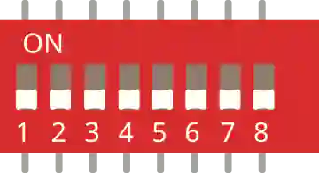 | `dip-switch` | [Interrupteur DIP ×8](../docs/fr/composants/dip-switch.md) | Commandes | Bloc de 8 micro-interrupteurs indépendants (configuration / adresses). |
| 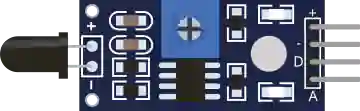 | `flame` | [Capteur de flamme](../docs/fr/composants/flame.md) | Capteurs | Détecteur de flamme (infrarouge). Sorties analogique et numérique. |
| 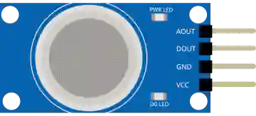 | `gas-sensor` | [Capteur de gaz (MQ)](../docs/fr/composants/gas-sensor.md) | Capteurs | Capteur de gaz/fumée série MQ. Sorties analogique (concentration) et numérique (seuil). |
| 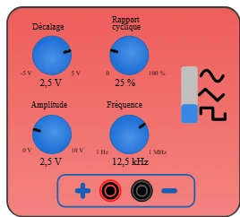 | `gbf` | [Générateur BF](../docs/fr/composants/gbf.md) | Appareils de mesure | Générateur de fonctions de la salle de TP : il sort un signal qui varie tout seul, là où l'alimentation de… |
|  | `grove-pico` | [Grove Shield (Pico)](../docs/fr/composants/grove-pico.md) | Cartes & platines | Carte d'extension Grove Shield for Pi Pico v1.0 (Seeed Studio). La Pico (ou Pico W) s'enfiche sur les deux… |
|  | `hall` | [Capteur à effet Hall](../docs/fr/composants/hall.md) | Capteurs | Détecteur de champ magnétique tout ou rien en boîtier TO-92 (A3144, A3141, US1881…). Tant qu'aucun aimant… |
|  | `hcsr04` | [Capteur ultrason HC-SR04](../docs/fr/composants/hcsr04.md) | Capteurs | Télémètre à ultrasons : mesure une distance (2–400 cm) par temps de vol. |
| 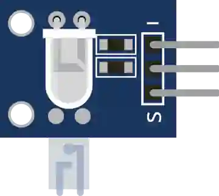 | `heartbeat` | [Capteur de pouls](../docs/fr/composants/heartbeat.md) | Capteurs | Capteur optique de fréquence cardiaque. Sortie analogique (pulsation). |
| 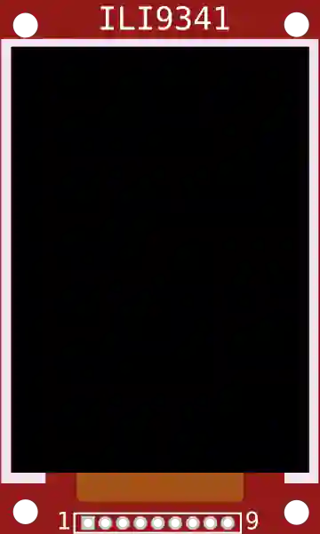 | `ili9341` | [Écran TFT (ILI9341)](../docs/fr/composants/ili9341.md) | Afficheurs | Écran TFT couleur 240×320 (SPI). Affiche textes, images et graphiques. |
|  | `joystick` | [Joystick analogique](../docs/fr/composants/joystick.md) | Commandes | Manette 2 axes (X/Y) avec bouton poussoir intégré. |
| 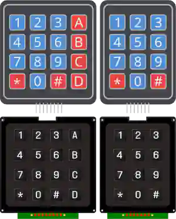 | `keypad` | [Clavier matriciel](../docs/fr/composants/keypad.md) | Commandes | Clavier à membrane ou à touche 4×3 ou 4×4 : matrice de touches lignes × colonnes. |
| 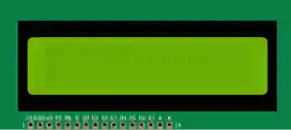 | `lcd` | [LCD Texte](../docs/fr/composants/lcd.md) | Afficheurs | Afficheur LCD à caractères (HD44780). 16×2 ou 20×4, en I²C (4 fils) ou parallèle. |
|  | `ldr` | [LDR (photorésistance)](../docs/fr/composants/ldr.md) | Discrets | Photorésistance nue, à deux pattes : sa résistance chute quand la lumière augmente. À ne pas confondre avec… |
| 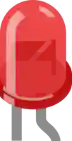 | `led` | [LED](../docs/fr/composants/led.md) | Discrets | Diode électroluminescente 5 mm. S'allume quand l'anode est au + et la cathode à la masse, via une résistance… |
| 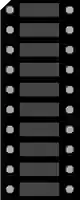 | `led-bar` | [Barre de LED](../docs/fr/composants/led-bar.md) | Afficheurs | Barregraphe de 10 LED indépendantes (anodes A1–A10, cathodes C1–C10). |
|  | `led-ring` | [Anneau NeoPixel](../docs/fr/composants/led-ring.md) | Afficheurs | Anneau de LED RGB adressables (WS2812). |
| 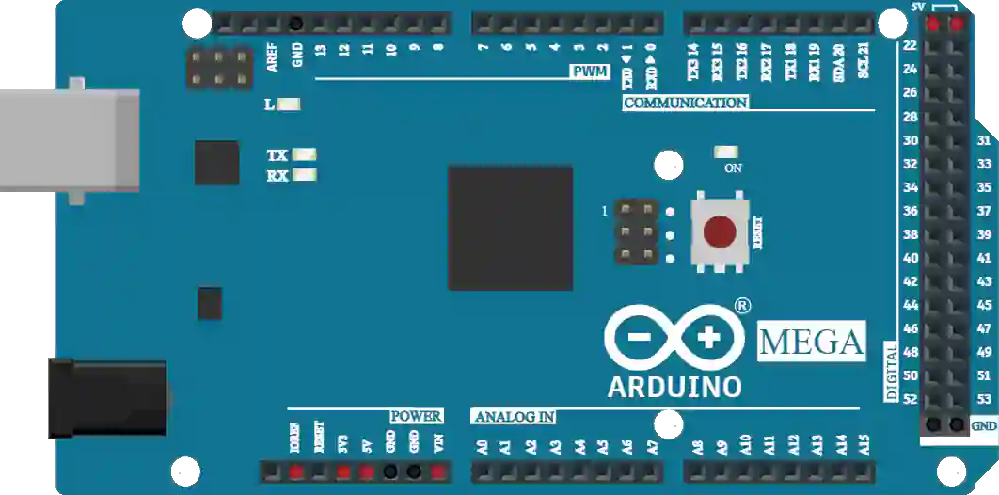 | `mega` | [Arduino Mega 2560](../docs/fr/composants/mega.md) | Cartes & platines | Carte ATmega2560 : 54 E/S numériques (15 PWM), 16 entrées analogiques, 4 UART. |
|  | `microsd` | [Carte microSD (SPI)](../docs/fr/composants/microsd.md) | Divers | Lecteur de carte microSD en SPI : stockage de fichiers. |
|  | `moteur-dc` | [Moteur à courant continu](../docs/fr/composants/moteur-dc.md) | Actionneurs | Petit moteur à courant continu, avec son pignon de sortie. Il tourne d'autant plus vite que la tension… |
|  | `multimetre` | [Multimètre](../docs/fr/composants/multimetre.md) | Appareils de mesure | Appareil de mesure à deux prises banane. L'inter à bascule choisit ce qu'il mesure : levier en haut = courant… |
| 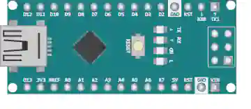 | `nano` | [Arduino Nano](../docs/fr/composants/nano.md) | Cartes & platines | Carte compacte ATmega328P (même cœur que l'Uno), format platine d'essai. |
|  | `neopixel` | [NeoPixel](../docs/fr/composants/neopixel.md) | Afficheurs | LED RGB adressable (WS2812). Chaînable : la sortie d'une LED alimente l'entrée de la suivante. |
| 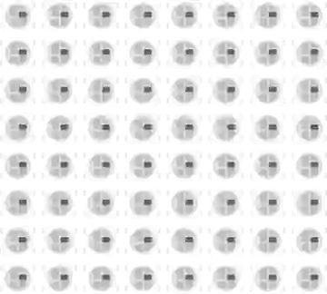 | `neopixel-matrix` | [Matrice NeoPixel](../docs/fr/composants/neopixel-matrix.md) | Afficheurs | Matrice de LED RGB adressables (WS2812), pilotée par une seule broche de données. |
|  | `ntc` | [Thermistance NTC](../docs/fr/composants/ntc.md) | Discrets | Thermistance à coefficient négatif : sa résistance baisse quand la température monte. Composant nu à deux… |
| 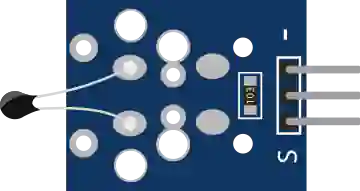 | `ntc-temp` | [Capteur de température NTC](../docs/fr/composants/ntc-temp.md) | Capteurs | Thermistance NTC : résistance fonction de la température. Sortie analogique. |
| 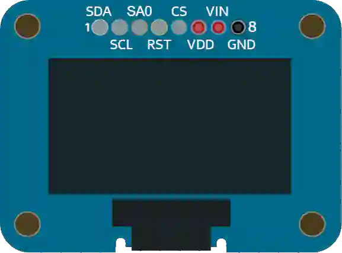 | `oled-ssd1306` | [Écran OLED (SSD1306)](../docs/fr/composants/oled-ssd1306.md) | Afficheurs | Petit écran OLED monochrome 128×64 (SPI). Idéal pour textes et graphiques. |
|  | `oscillo` | [Oscilloscope](../docs/fr/composants/oscillo.md) | Appareils de mesure | Appareil de mesure à deux prises banane, comme le multimètre — mais au lieu d'un chiffre, il dessine la… |
|  | `patte` | [Patte de robot araignée](../docs/fr/composants/patte.md) | Système | Patte de robot articulée à 2 servomoteurs internes indépendants : la coxa, qui balaie la patte au sol… |
| 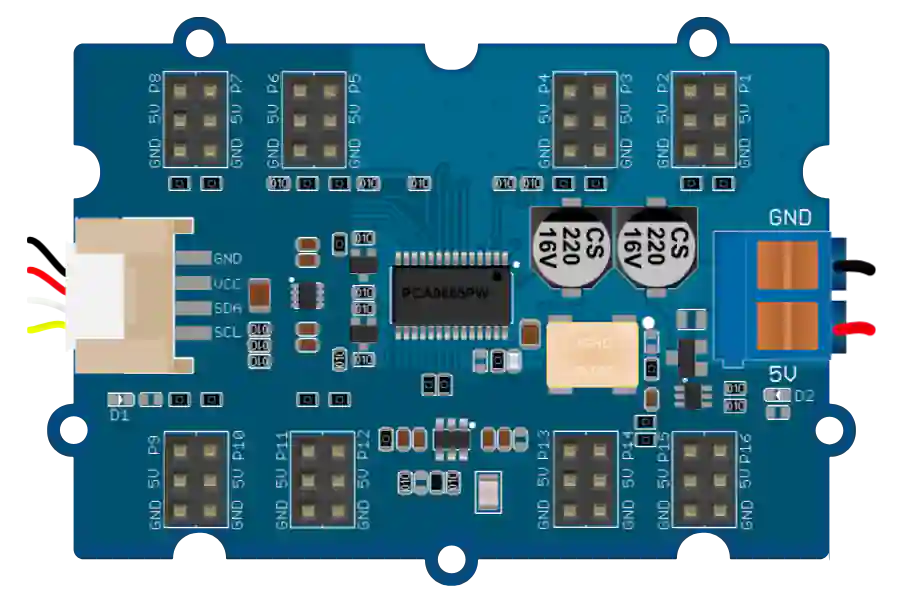 | `pca9685` | [Pilote PWM 16 canaux (PCA9685)](../docs/fr/composants/pca9685.md) | Divers | Module Grove 16-Channel PWM Driver de Seeed (réf. 108020102), basé sur le NXP PCA9685 : 16 sorties PWM 12… |
|  | `photodiode` | [Photodiode](../docs/fr/composants/photodiode.md) | Discrets | Photodiode nue, à deux pattes, dans un boîtier transparent : elle laisse passer un courant proportionnel à la… |
| 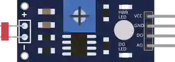 | `photoresistor` | [Photorésistance (LDR)](../docs/fr/composants/photoresistor.md) | Capteurs | Capteur de lumière : sa résistance varie avec l'éclairement. Sortie analogique et numérique. |
|  | `phototransistor` | [Phototransistor](../docs/fr/composants/phototransistor.md) | Discrets | Phototransistor nu, à deux pattes, dans un boîtier transparent : il laisse passer d'autant plus de courant… |
| 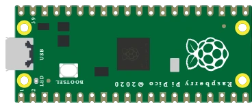 | `pico` | [Raspberry Pi Pico](../docs/fr/composants/pico.md) | Cartes & platines | Carte microcontrôleur RP2040 (double cœur ARM Cortex-M0+). 26 broches GPIO, 3 entrées analogiques (ADC)… |
|  | `pico2` | [Raspberry Pi Pico 2](../docs/fr/composants/pico2.md) | Cartes & platines | Carte microcontrôleur RP2350 (double cœur ARM Cortex-M33 à 150 MHz), successeur du Pico. Même format, même… |
|  | `pico2w` | [Raspberry Pi Pico 2 W](../docs/fr/composants/pico2w.md) | Cartes & platines | Identique au Pico 2 (RP2350, double cœur Cortex-M33 à 150 MHz, 3,3 V, mêmes broches) avec un module… |
|  | `picow` | [Raspberry Pi Pico W](../docs/fr/composants/picow.md) | Cartes & platines | Identique au Pico (RP2040, 3,3 V, mêmes broches) avec un module Wi-Fi/Bluetooth intégré. Le brochage physique… |
|  | `pir` | [Capteur de mouvement PIR](../docs/fr/composants/pir.md) | Capteurs | Détecteur de mouvement infrarouge passif. Sortie numérique haute en cas de détection. |
|  | `pot` | [Potentiomètre](../docs/fr/composants/pot.md) | Commandes | Résistance variable à bouton rotatif. Le curseur fournit une tension proportionnelle à sa position. |
|  | `pot-rot2` | [Potentiomètre ajustable](../docs/fr/composants/pot-rot2.md) | Commandes | Petit potentiomètre réglé au tournevis (trimmer, ajustable) : on le pose une fois pour caler un seuil, un… |
|  | `powerbank` | [Batterie externe (Power bank)](../docs/fr/composants/powerbank.md) | Divers | Batterie portable USB : source de tension fixe 5 V, sans réglage — contrairement à l'alimentation de… |
| 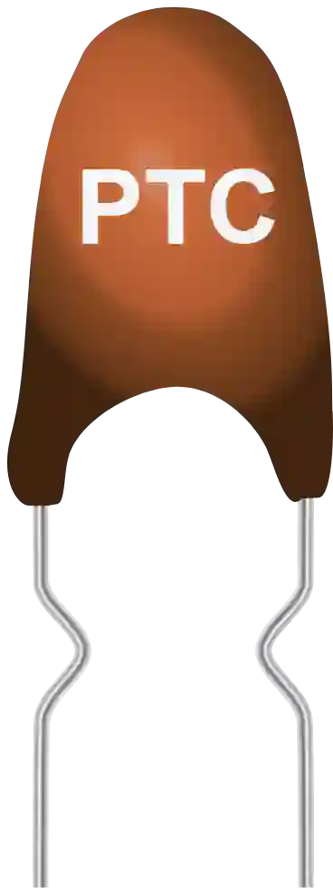 | `ptc` | [Thermistance PTC](../docs/fr/composants/ptc.md) | Discrets | Thermistance à coefficient positif : sa résistance monte avec la température. Sert de capteur linéaire… |
|  | `relais` | [Relais OMRON G5V](../docs/fr/composants/relais.md) | Commandes | Relais électromécanique 1 RT (un contact inverseur). Une bobine, alimentée sous sa tension nominale, attire… |
|  | `resistor` | [Résistance](../docs/fr/composants/resistor.md) | Discrets | Résistance fixe. Limite le courant (LED) ou forme un pont diviseur / pull-up / pull-down. |
| 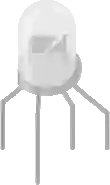 | `rgb-led` | [LED RGB](../docs/fr/composants/rgb-led.md) | Discrets | LED tricolore (rouge/vert/bleu) à cathode (ou anode) commune. Mélange des trois canaux pour obtenir n'importe… |
| 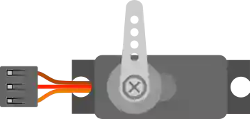 | `servo` | [Servomoteur](../docs/fr/composants/servo.md) | Actionneurs | Servomoteur positionnel commandé par un signal PWM (angle 0–180°). |
|  | `slide-pot` | [Potentiomètre à glissière](../docs/fr/composants/slide-pot.md) | Commandes | Potentiomètre linéaire à curseur coulissant. Même principe que le rotatif. |
| 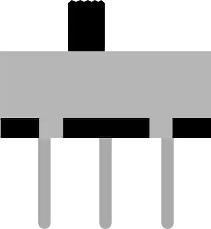 | `slide-switch` | [Interrupteur à glissière](../docs/fr/composants/slide-switch.md) | Commandes | Interrupteur SPDT à 2 positions : le commun bascule entre deux bornes. |
|  | `sonde-logique` | [Sonde logique](../docs/fr/composants/sonde-logique.md) | Appareils de mesure | Petite pince crocodile de mesure. Elle ne se câble pas : on la pose sur la pastille d'une broche de la carte… |
| 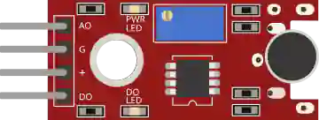 | `sound` | [Capteur de son](../docs/fr/composants/sound.md) | Capteurs | Microphone avec comparateur. Sorties analogique (niveau) et numérique (seuil). |
| 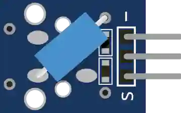 | `tilt` | [Capteur d'inclinaison](../docs/fr/composants/tilt.md) | Capteurs | Interrupteur à bille : se ferme/ouvre selon l'inclinaison. |
|  | `transistor` | [Transistor](../docs/fr/composants/transistor.md) | Discrets | Transistor en boîtier TO-92 ou TO-220. En Kablix il sert d'interrupteur commandé : un petit courant de base… |
| 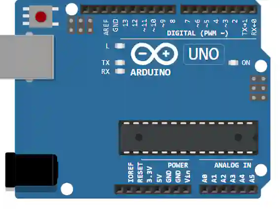 | `uno` | [Arduino Uno](../docs/fr/composants/uno.md) | Cartes & platines | Carte ATmega328P : 14 E/S numériques (6 PWM), 6 entrées analogiques, USB. |
|  | `ventilo` | [Ventilateur](../docs/fr/composants/ventilo.md) | Actionneurs | Ventilateur à courant continu. L'hélice tourne d'autant plus vite que la tension appliquée est élevée ; il se… |

## Utilisation

1. Ouvrir un schéma dans Kablix
2. Clic sur **⚙ Gérer les composants** dans la palette
3. Sélectionner les composants et clic sur **Télécharger**

## Contribution

Pour proposer un composant :
1. Créer un dossier local `kablix_components/`
2. Concevoir le composant avec Kablix (bouton **+ Créer un composant**)
3. Exporter en **⇩** (fichier .kompix)
4. Proposer une pull request sur le dépôt

## Pourquoi cette bibliothèque reste dans le dépôt de Kablix

La question se pose : un dépôt séparé ne serait-il pas plus propre ? **Non, pas au volume actuel.**

Ce dossier **n'est pas livré dans l'extension** (il est écarté par `.vscodeignore`) : il est servi directement depuis GitHub, en `raw`, et l'extension le télécharge à la demande. Il ne pèse donc rien pour l'utilisateur, et ses 9 composants tiennent dans quelques centaines de kilo-octets.

| Ce qu'un dépôt dédié apporterait | Ce qu'il coûterait |
|---|---|
| Un historique séparé de celui du code | Deux dépôts à cloner, deux à étiqueter, deux à garder en phase |
| Des contributions externes sans accès au code | L'URL du dépôt officiel est **écrite dans le code** (`kompixLibrary.ts`) : la changer casse toutes les installations en place |
| Un cycle de publication propre aux composants | Les scripts de construction (`build-kompix.mjs`, `build-components-index.mjs`) et les bancs (`verify:kompix`) vivent dans le dépôt du code |
| | Un composant et le code qui le simule se modifient **ensemble** : séparés, un enregistrement sur deux devient une paire d'enregistrements à synchroniser |

Le point décisif est le dernier : tant qu'un composant de bibliothèque peut dépendre d'une version de l'extension, les deux doivent avancer dans le même enregistrement.

**Quand reconsidérer :** si la bibliothèque dépasse quelques dizaines de mégaoctets, si des contributeurs extérieurs deviennent réguliers, ou si les composants cessent d'être couplés aux versions de l'extension. D'ici là, le dossier reste ici.

---

Généré le 24/09/2026 09:34:31 — Kablix v2026.9.4
